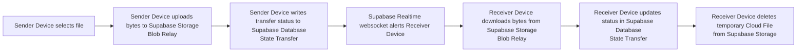

# Relay

Relay is a secure file relay application built with Flutter that enables users to send and receive files across devices using a short-code pairing model.

Each user is provisioned with an anonymous identity and a 6-character Relay code. A sender targets a recipient code, uploads file bytes to a cloud relay, and the receiver is notified through database state updates streamed to the UI.

## Core Capabilities

The following capabilities are currently implemented in code:

- Anonymous onboarding with short-code provisioning and collision retry.
- Short-code based recipient routing (`users.short_code -> users.id`).
- Cloud relay transfer pipeline using Supabase Storage and a `transfers` table.
- Real-time incoming transfer list updates via Supabase Postgres stream subscriptions.
- Upload and download progress reporting in UI using `TransferBloc` states.
- Local recovery queue for interrupted uploads and downloads using SharedPreferences.
- Native file picker integration (Android/iOS) through Pigeon host APIs.
- Native save/share integration through platform channels.
- Receiver-side cleanup of temporary cloud file after successful download.
- Nearby device discovery/broadcasting over local network (NSD/Bonjour) to accelerate recipient selection.

## Architecture and Technology Stack

### Client

- Flutter (Dart 3.11+) mobile client.
- BLoC pattern with feature-scoped blocs:
	- `OnboardingBloc`
	- `TransferBloc`
	- `IncomingBloc`
	- `NearbyBloc`
- `dio` for upload/download transport and progress callbacks.
- `shared_preferences` for durable local recovery queues and local identity storage.

### Cloud Relay and State

- Supabase Auth: anonymous sign-in for per-device user identity.
- Supabase Postgres (`users`, `transfers`): routing and transfer state machine.
- Supabase Storage (`media` bucket): temporary relay blob storage.

### Why Supabase

Supabase is used as the temporary cloud relay because it provides a unified ecosystem for object storage and database state management without requiring custom backend routing services or standalone application servers.

### Why Supabase Realtime

Supabase Realtime (PostgreSQL websocket stream) is used to push transfer state changes directly into the UI (for example, status transitions such as `transferring -> completed -> downloaded`). This removes the need for aggressive client-side HTTP polling, reducing latency and avoiding unnecessary battery and radio usage.

## Infrastructure Limitations

Because the deployment target is Supabase Free Tier, the following operational limitations apply:

- The database instance may pause after inactivity windows, which can lead to websocket timeouts until the database is resumed.
- Free Tier plans enforce limits on concurrent Realtime websocket connections. Stale background sessions may be dropped and may require an app restart to fully reset the active connection pool.

## Relay Lifecycle



## Technical Implementation (Codebase Audit)

This section reflects audited behavior from the current `lib/`, `android/`, and `ios/` code.

### State Management

- `OnboardingBloc`
	- Checks local short code first.
	- Provisions anonymous Supabase identity when absent.
	- Generates 6-character codes from `ABCDEFGHJKMNPQRSTUVWXYZ23456789` and retries on unique-key collisions.
	- Emits staged onboarding loading messages (`Checking local identity`, `Creating secure session`, `Assigning Relay ID`, `Finalizing setup`).

- `TransferBloc`
	- Handles send, download, cancel, reset, and startup recovery.
	- Emits per-transfer active IDs for scoped progress rendering.
	- Persists pending download IDs before download starts and removes them on success/cancel cleanup.

- `IncomingBloc`
	- Maintains realtime incoming list subscription.
	- Preserves last known list if stream errors occur.
	- Emits a user-friendly failure while still exposing cached transfer data.

- `NearbyBloc`
	- Starts/stops NSD discovery stream.
	- Emits discovered local services and failure state.

### Local Recovery Mechanisms

- SharedPreferences keys:
	- `user_short_code`
	- `pending_transfers` (`path|recipientCode` entries)
	- `pending_downloads` (transfer IDs)

- Upload recovery:
	- `pending_transfers` is populated before upload.
	- On startup, recovery checks local file existence and re-dispatches send if file is still present.

- Download recovery:
	- `pending_downloads` is populated before download.
	- On startup, each queued transfer ID is fetched from database:
		- removed if missing or already `downloaded`
		- resumed only if status is `completed`

### Native Platform Channels (Pigeon + Host Code)

`MediaSaverApi` host interface is generated with three methods and implemented on both platforms:

- `saveFile(path, name, mime)`
- `shareFile(path, mime)`
- `pickFiles(allowMultiple)`

Android (`MainActivity.kt`):

- Saves downloaded files into `MediaStore.Downloads`.
- Shares local files via `FileProvider` + `ACTION_SEND`.
- Opens file picker via `ACTION_OPEN_DOCUMENT`, copies selected URIs into app-local files, and returns local paths.

iOS (`AppDelegate.swift` + `MediaSaverHandler`):

- Saves images/videos through Photo Library add-only flow.
- Shares local files via `UIActivityViewController`.
- Picks files via `UIDocumentPickerViewController`, copies selected files into app Documents, and returns local paths.

### Transfer and Realtime Semantics

Observed transfer status values in active code:

- `pending`
- `transferring`
- `completed`
- `failed`
- `downloaded`

Realtime stream filtering includes `pending`, `transferring`, `completed`, and `downloaded`, allowing UI to show in-progress and completed incoming items.

### Nearby Transport Status

Nearby local network components are present and active for discovery/broadcasting:

- Device broadcasts a `_relay._tcp` service named with the local short code.
- Nearby sheet discovers devices and filters out self code.
- Selection of a nearby device currently returns the discovered service name (code) and then routes through the standard cloud relay send flow.

Code-level direct local socket send/receive primitives are also implemented in `NearbyRepository` (`sendFile`, TCP server receive path). The current UI send path, however, uses discovered code plus Supabase transfer rather than directly invoking `sendFile`.

### Behavior During Network Drops

Based on current error handling code:

- Upload/download Dio transport exceptions are mapped to user-friendly connection messages.
- Transfer failures emit `TransferFailure` and are surfaced via snackbar.
- Incoming realtime subscription errors emit `IncomingFailure` but preserve and continue rendering last known transfer list.
- There is no explicit exponential backoff or retry scheduler for failed send/download operations.

### Behavior During OS Process Death

Based on startup and recovery flow:

- Recovery runs from `HomeScreen.initState` by dispatching `RecoveryRequested`.
- Interrupted uploads can resume only if queued file paths still exist locally.
- Interrupted downloads can resume only if queued transfer IDs still exist and remain in `completed` status.
- Recovery does not run as a detached background task while the app is terminated; it executes when the app is relaunched into the Home screen flow.

## Local Development

### Prerequisites

- Flutter SDK compatible with Dart `^3.11.3`.
- A Supabase project with:
	- `users` table (with unique `short_code`)
	- `transfers` table containing the fields used by `TransferData`
	- `media` storage bucket

### Environment

Create `.env` in repository root:

```env
SUPABASE_URL=...
SUPABASE_ANON_KEY=...
```

### Run

```bash
flutter pub get
flutter run
```
